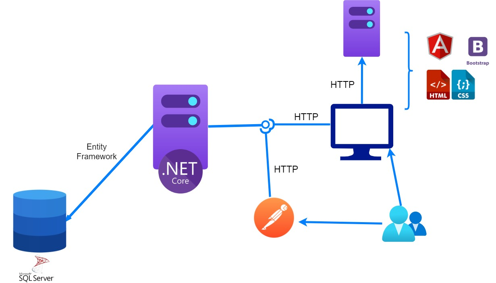

# Introducción

Durante el curso se enseñará como crear una aplicación web cliente-servidor, es decir, un back-end con funcionalidad y base de datos, y una SPA (Single Page Application) que será la encargada de ser la UI y se comunicará con el servidor.

El mismo se divide en dos partes:

 **La primera** es la construcción de una API (Application Programming Interface) REST la cual se creará utilizando [.Net Core](https://dotnet.microsoft.com/learn/dotnet/hello-world-tutorial/install).

La WebApi a través de Entity Framework se comunicará con una base de datos [SQL Server](https://www.microsoft.com/es-mx/sql-server/sql-server-downloads?rtc=1).

Durante esta etapa no habrá una GUI de usuario por lo que utilizaremos [Postman](https://www.postman.com) para simular invocaciones a la API.

**La segunda** es la construcción de una [SPA](https://blog.angular-university.io/why-a-single-page-application-what-are-the-benefits-what-is-a-spa/) (aplicación web) con la que el usuario podrá utilizar el sistema. La misma se realizará en [Angular](https://angular.io).

# Stack de tecnologías a emplear
## Visual Studio Code

[Visual Studio Code](https://code.visualstudio.com) es un editor de texto que soporta todo lo que requerimos para el desarrollo del trabajo tanto en C# (Back-end) como para TypeScript (Front-end). Es posible agregarle algunas extensiones y completar su funcionalidad. 

## Extensiones necesarias:

 - [C# for Visual Studio](https://marketplace.visualstudio.com/items?itemName=ms-dotnettools.csharp) Extensión que facilita el desarrollo en C# con Visual Studio Code.
 - [TSLint](https://marketplace.visualstudio.com/items?itemName=ms-vscode.vscode-typescript-tslint-plugin) Extensión que facilita el desarrollo con TypeScript en Visual Studio Code.
 - [NuGet Gallery](https://marketplace.visualstudio.com/items?itemName=patcx.vscode-nuget-gallery) Extensión para tener la galeria de librerias en VSC.
 - [Live Share](https://marketplace.visualstudio.com/items?itemName=MS-vsliveshare.vsliveshare) Extensión que sirve para mostrar y codificar de a pares.
 - [C# Estensions](https://marketplace.visualstudio.com/items?itemName=jchannon.csharpextensions) Extensión para crear archivos más fácil.

Si conocen más extensiones pueden utilizarlas.

## Base de datos
En el curso vamos usar el motor de base de datos [SQL Server](https://www.microsoft.com/es-mx/sql-server/sql-server-downloads?rtc=1). Para quienes utilicen MAC deben utilizar [Docker](https://www.docker.com/get-started)(Les dejamos una [guia](https://cheerful-nation-1ca.notion.site/Instalaci-n-SQL-server-MacOS-c8e0aedbf5c64729a0f1e3f1eee71b0a) de instalación y de uso).

## Postman
Utilizaremos [Postman](https://www.postman.com/) (version 7.18 o superior) mientras no se tenga desarrollada la GUI.

## Framework
Para lo que es la codificación del **backend** vamos a usar la última versión de [.Net Core](https://dotnet.microsoft.com) (version 5.0).

Para lo que es la codificación del **frontend** vamos a usar  [Angular](https://angular.io).

Para que nos funcione Angular es necesario tener [Node](https://nodejs.org/es/download/) (version 14.17.5 LTS)

## Gestión del código
Es imprescindible tener GIT instalado en el equipo ya que es el repositorio que vamos a utilizar.

-Se consigue acá: [GIT](https://git-scm.com), se recomienda trabajar con una aplicacion GUI como [Github Desktop](https://desktop.github.com/) o [GitKraken](https://www.gitkraken.com/).

# Interacción de todas las tecnologías del curso

Tener en cuenta que este diagrama no respeta ningún tipo de notación del curso y por ende no debería ser usado dentro de la documentación de su obligatorio.

# Conceptos que se necesitan desde el día 0

A nivel teórico y tecnológico todo lo que se dictó en Diseño de Aplicaciones 1 se entiende como ya "dado" en este curso y por ello, los aspectos centrales deben estar claros: 
	
- Buenas prácticas de codificación y diseño, por ejemplo Clean Code, principios SOLID y GRASP, codificación con TDD y Refactoring.
- UML
- Como se codifica en C#
- Se necesita tener claro el concepto de ORM y lo visto para Entity Framework. En particular vamos a usar [EF Core](https://www.entityframeworktutorial.net/efcore/entity-framework-core.aspx).
- Buen manejo de Git. El manejo de git y de gitflow es importante durante el curso. Se utilizará Github, es necesario aprender como funciona la herramienta. Para repasarlo   [Pro GIT](https://bibliotecas.ort.edu.uy/bibid/80216) (Libro muy completo sobre la funcionalidad de Git. Se encuentra en biblioteca).
